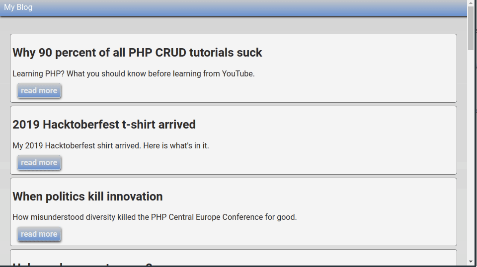

# Dead simple PHP blog implementation

**clone, style, use.**

As easy as it gets:

Leveraging 
- blua-blue/blua-blue-php-sdk
- neoan3-apps/template
- vlucas/phpdotenv

## Installation

1. Download or clone repository. 
2. Run `composer update`
3. Copy `.env_example` to `.env`
4. Use your [blua.blue](https://blua.blue) credentials

### Customize

Use any CSS-framework, any markup, any PHP framework. 

#### Templates

`template/main.html` (HTML skeleton)
`template/list.html` (article-list markup)
`template/blog.html` (single article markup)
`template/style.css` (demo style)